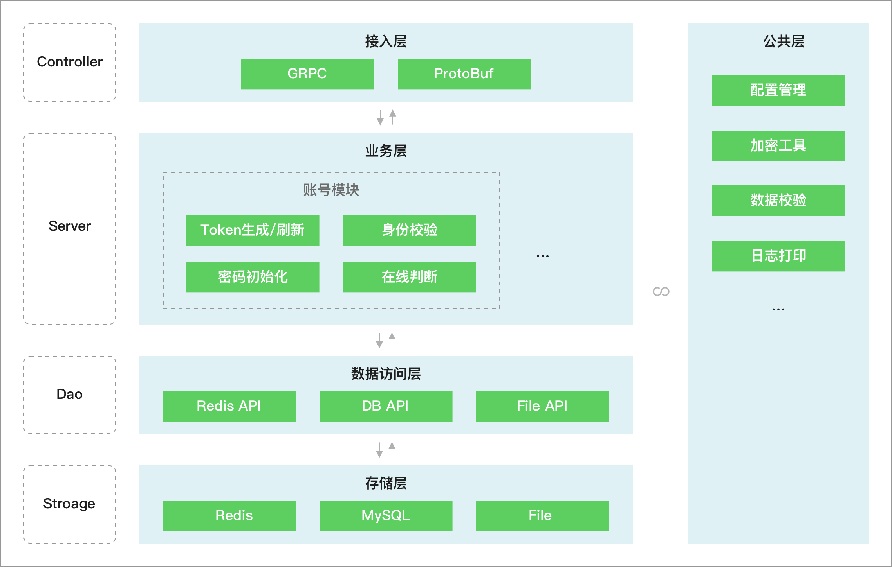

# 单终端登录系统

## 功能简介

1. 具备注册登录功能
2. 一个⽤户只能在一个设备上登录，切换终端登录时，其他已登录的终端会被踢出

## 技术简介

- 客户端用Android实现，采用Djinni实现跨平台开发（Android & IOS with c++）
- 后台用C++实现
- 采用GPRC进行远程通信，自己生成非对称密钥（crt\key\pem），使用SSL进行数据传输加密
- 采用bazel构建后台项目，以及依赖管理
- 采用docker部署项目，并使用docker-compose编排容器

## 项目图示

## 开发过程

为期19天，01-22 ~ 02-09

### 01.22

理解需求，拆分任务。初步判断每一块技术需要的时间，制定工作计划。
1. c++(每一天学习)
2. Djinni（4天）
3. Grpc & Protobuf（4天）
4. bazel（4天）
5. docker & docker-compose（3天）

### 1.23-1.26

学习Djinni，并跑通一个demo

过程：
根据官网说明生成相关cpp，配置正确，生成文件已导入，但是运行不起来，错误信息很模糊，报无引用。

原因：
.djinni 文件中定义了 +c 类，需要自己编写实现类，实现相关抽象方法（如：create方法），把实现类也引入项目。

### 1.27-1.30

学习grpc以及protobuffer，并跑通一个demo
学习bazel，并跑通一个demo
结合三者跑通一个后台demo

过程：
GRPC官方githubDemo运行问题
 - macOS 插件不支持或不友好
 - 阿里云：Centos 安装插件命令yum
 - 阿里云：Ubuntu apt-get 终于安装好相关插件，但是不管是官方demo，还是GitHub上的个人开源demo都跑不起来；尝试自己从最简单的bazel c++ 到 bazel c++ grpc ，意外发现构建到boringssl这个插件时就卡住，查询发现boringssl需要科学上网，由此猜测是不是之前所有的demo都跑不起来的原因是没有科学上网导致的
 - 国外服务器：Ubuntu 再次尝试，终于顺利bazel构建官方grpc demo

总结：
1. 使用Ubuntu系统
2. 科学上网。自己设置代理或直接用国外服务器
3. bazel-0.20.0。版本差异，构建过程中会报错（可能最新版不会）

### 1.31

学习docker以及docker-compose相关命令，安装到服务器，编写Dockerfile和docker-compose.yml配置文件，将后台demo跑通

### 2.1
编写客户端Java层UI、C++层业务代码、JNI接口代码。

### 2.5
学习GRPC-SSL相关知识以及相关类方法，通过OpenSSL生成密钥文件，实现客户端与服务器端的加密通信

### 2.6
尝试用mongo作为数据库存储方案，未果，决定暂时存储在内存中。
开始实现服务器端代码

### 2.7

实现服务器端代码

### 2.8

编写系统文档

### 2.9

整理代码，优化代码
